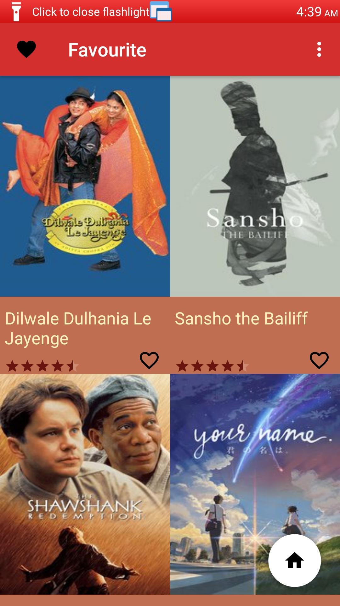
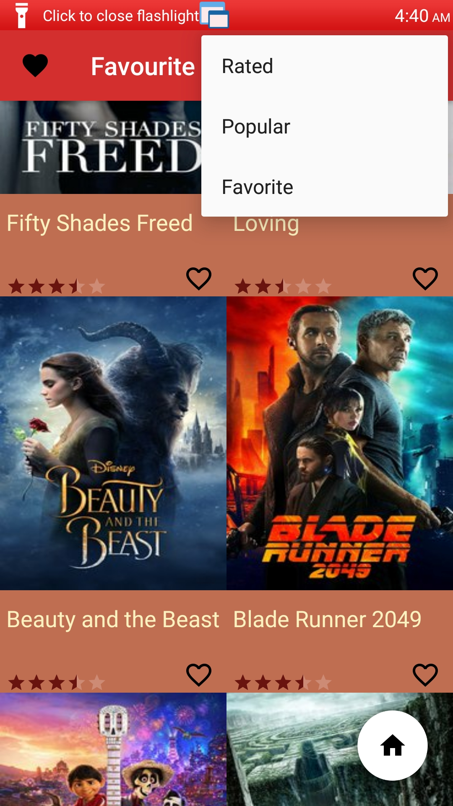
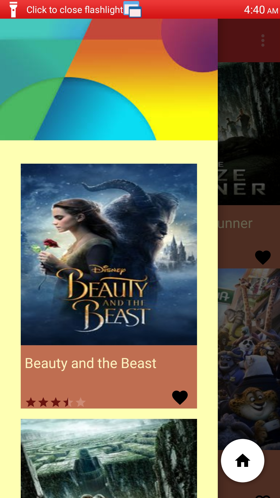
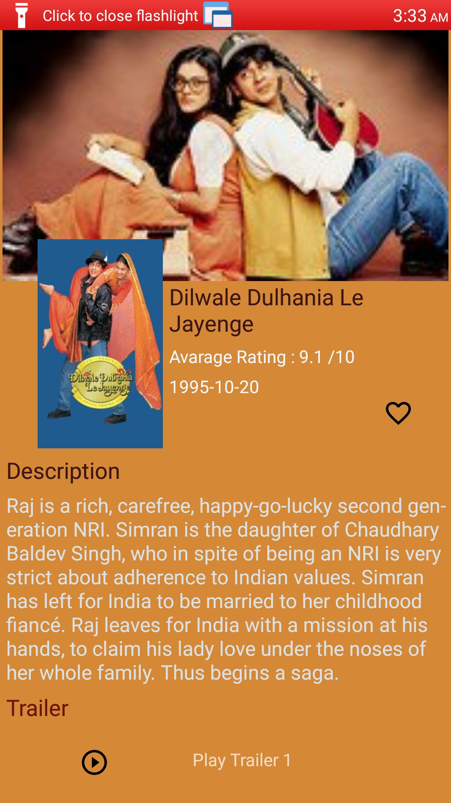
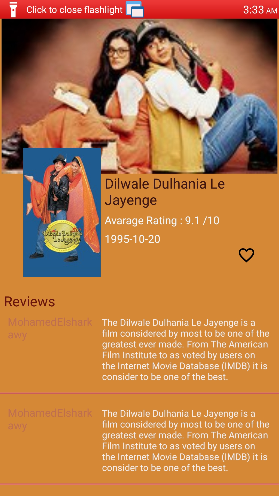
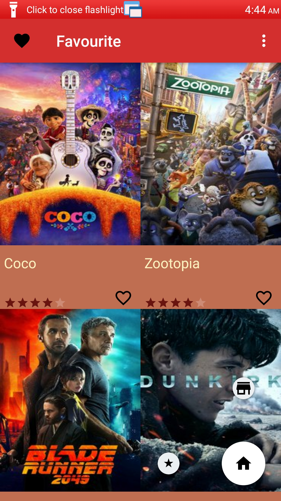
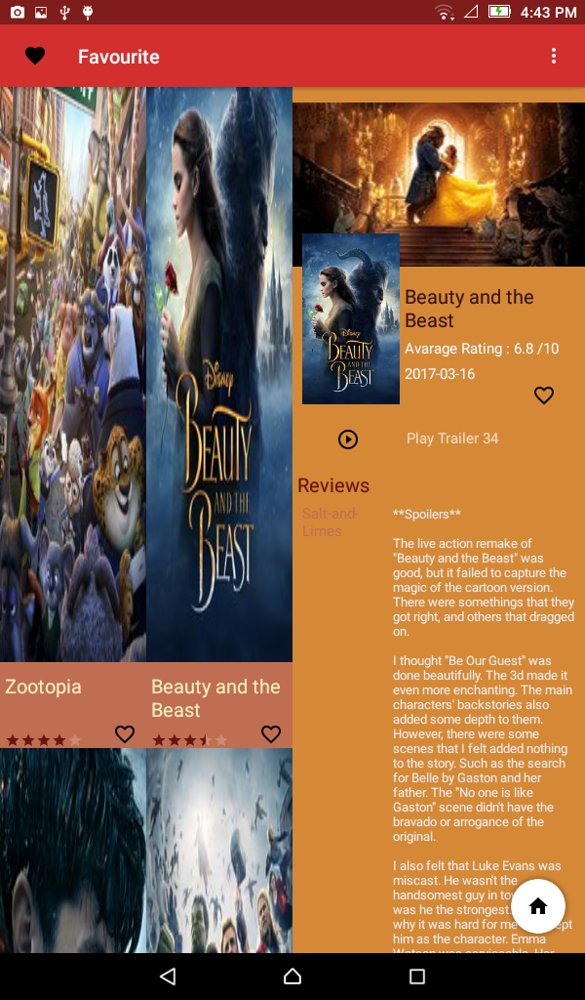
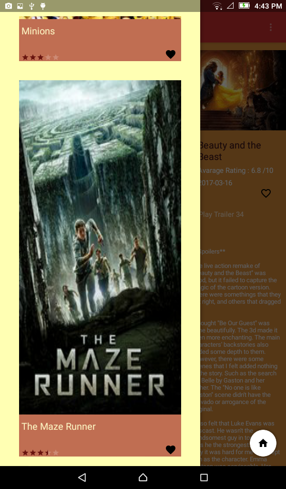
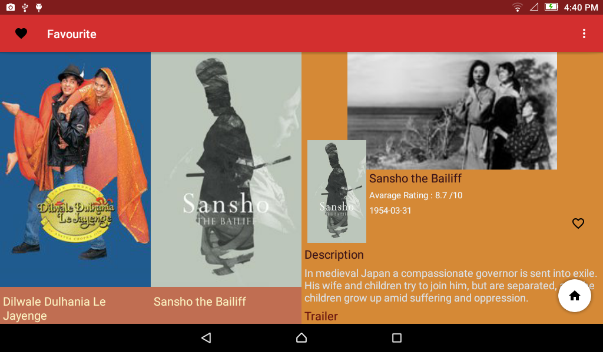
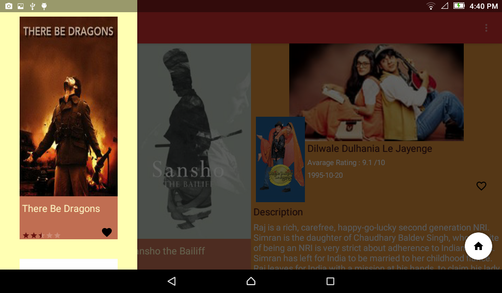

# **MovieApp**   :star:  :star:
### This app show Movies with top Rated and Most Popular 
## Synopsis 
- _show Top Rated Movies_ .
- _Show Most Popular Movie_ .
- _Details About each Movie Like Name , Rated Avarage , Story , Release data , Cover And Photo_ .
- _Different Tablet Show_ .
- _Sorted Movie By Name Or Rated By Floating Button_ .
- _Show Trailers And Review For each Movie_ .
- _Mark Movie As A Favourite Then Save It To Watch Later_ .
- _Use Navigation Drawerer To Show Saved Movies_ .
## Tests
### Rated / Popular Sorted
 
### Navigation Drawer With Favourite Movie 

### Details 

 
### Sorted By Name && Rated

 

### Tablet View 

#### land Mode 

  

  

#### Portrait Mode 

  

  

## Apk File If You Want To use it

https://drive.google.com/file/d/11o72k5X_4OG690LGIx52E6iA1KITa909/view?usp=sharing

 

